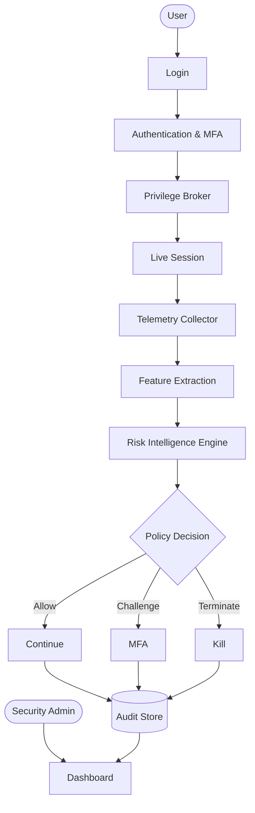
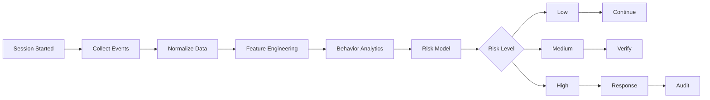
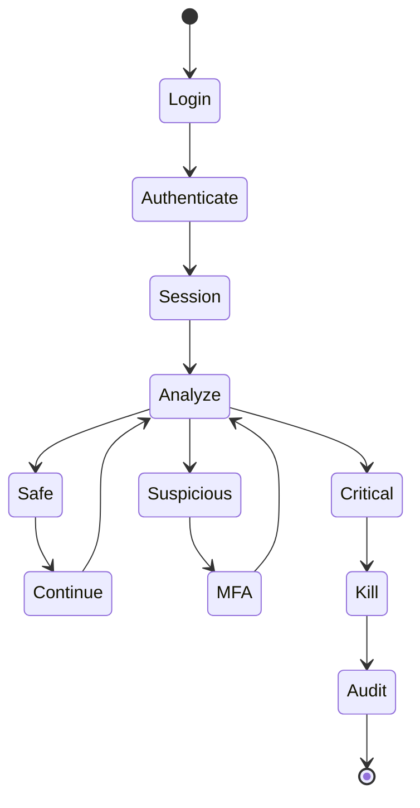
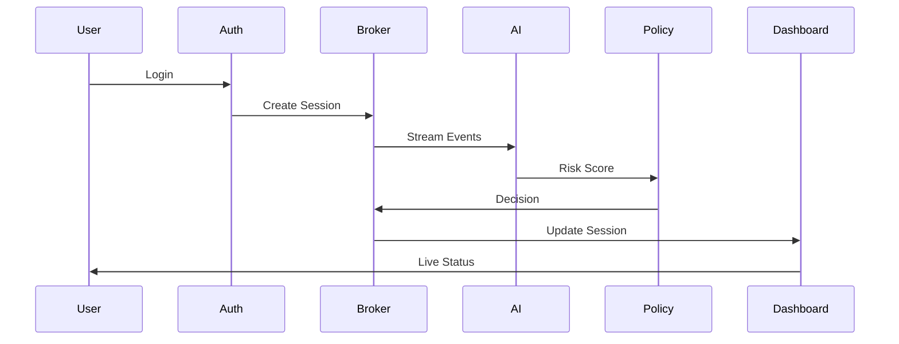
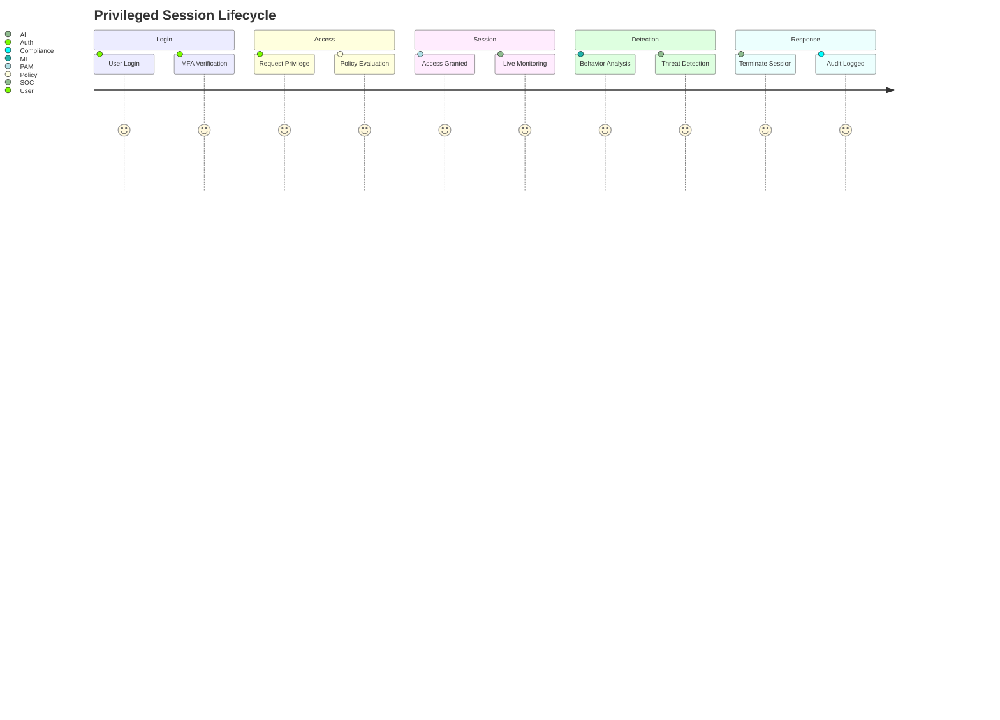
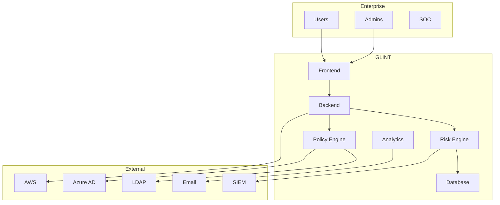

<p align="center">
  
</p>

<div align="center">

# GLINT

### Predictive Privileged Access Intelligence

Monitor privileged sessions in real time, explain every risk decision, and enforce
policy-driven responses before security incidents escalate.

<p>
  <a href="https://glint-blue.vercel.app">
    
  </a>
  <a href="https://drive.google.com/file/d/1w2L1zqdJJ6jwAlUp1MBBb1fvlaYs11N6/view?usp=sharing">
    
  </a>
</p>

<p>
  
  
  
  
  
  
</p>

</div>

---

## Overview

GLINT is a privileged access management platform focused on **continuous risk evaluation** rather than post-incident investigation.

Instead of waiting until a privileged session violates policy, GLINT evaluates every session as it unfolds. User behavior, access history, command execution, resource sensitivity, and contextual signals are continuously analyzed to determine whether a session should continue, require additional verification, or be terminated.

Risk assessment remains explainable at every stage. Machine learning provides behavioral context, while deterministic security policies retain final authority over access decisions. Every alert, score, and enforcement action can be traced back to the events that produced it.

---

## Problem

Most privileged access solutions answer one question:

**"What happened?"**

Traditional PAM products authenticate users, record sessions, and generate alerts after policy violations occur. They provide visibility but very little prediction.

Security teams still investigate thousands of privileged sessions manually, and insider threats often resemble normal administrator activity until it's too late.

## Solution

GLINT shifts the focus from recording activity to understanding it.

By continuously evaluating behavior during an active session, GLINT can identify abnormal privilege usage early enough for security policies to intervene before damage occurs, combining behavioral analytics with deterministic policy enforcement so every decision stays explainable.

---

## Highlights

- Continuous privileged session monitoring
- Explainable behavioral risk scoring
- Just-in-Time privileged access
- Live command and query analysis
- Policy-based enforcement engine
- Automated session termination
- Complete, immutable audit trail
- Enterprise authentication support (AD, LDAP, SAML, OAuth2)
- Compliance-ready reporting

---

## Live Demo

| Resource | Link |
|---|---|
| 🌐 Application | https://glint-blue.vercel.app |
| 🎥 Demonstration | https://drive.google.com/file/d/1w2L1zqdJJ6jwAlUp1MBBb1fvlaYs11N6/view?usp=sharing |

---

## Architecture



## Risk Scoring Pipeline



## Decision Engine



## Session Data Flow



## Privileged Session Lifecycle



## Enterprise Deployment



---

## Risk Intelligence Engine

Every privileged session is continuously analyzed using multiple contextual signals, including:

- Login location anomalies
- Device trust
- Session duration
- Command frequency
- Sensitive database access
- Privilege escalation attempts
- Abnormal working hours
- Historical behavior deviation
- Failed authentication patterns
- Insider threat indicators

Each feature contributes to an explainable risk score that evolves throughout the session — no black-box outputs, every point on the score traces back to a source event.

## Automated Response

| Risk Level | Automated Action |
|---|---|
| Low | Continue monitoring |
| Medium | Notify security team |
| High | Require re-authentication |
| Critical | Kill session, revoke credentials, generate incident ticket |

---

## Technology Stack

| Layer | Technologies |
|---|---|
| Frontend | React · TypeScript · Tailwind CSS |
| Backend | FastAPI · Python |
| AI / Analytics | Scikit-learn · Pandas · NumPy |
| Database | PostgreSQL |
| Authentication | JWT · OAuth2 |
| Deployment | Docker · Vercel · AWS / Azure |

---

## Project Structure

```text
GLINT
├── frontend/
│   ├── components/
│   ├── pages/
│   └── services/
├── backend/
│   ├── api/
│   ├── auth/
│   ├── monitoring/
│   ├── ai/
│   ├── policies/
│   └── database/
├── docs/
├── assets/
└── README.md
```

---

## Quick Start

**Backend**

```bash
git clone https://github.com/<your-repository>
cd GLINT

pip install -r requirements.txt
uvicorn app.main:app --reload
```

**Frontend**

```bash
cd frontend
npm install
npm run dev
```

Application runs locally at:

```
Frontend → http://localhost:5173
Backend  → http://localhost:8000
```

---

## Enterprise Integrations

**Authentication** — Active Directory · LDAP · OAuth2 · SAML · Keycloak

**Monitoring** — Splunk · QRadar · Microsoft Sentinel · Elastic

**Cloud** — AWS · Azure · Google Cloud

**ITSM** — ServiceNow · Jira

---

## Why GLINT

| Traditional PAM | GLINT |
|---|---|
| Reactive monitoring | Predictive intelligence |
| Static policies | Adaptive risk decisions |
| Manual investigation | Automated response |
| Session recording only | Behavioral analytics |
| Alerts after the fact | Detection before damage |
| Fixed thresholds | AI-powered risk scoring |

---

## Roadmap

- [ ] Real-time SSH/pgwire session broker for live event ingestion
- [ ] Expanded rule library for deterministic policy overrides
- [ ] SOC case management integration
- [ ] Multi-tenant deployment support
- [ ] Fine-grained RBAC for dashboard access

---

## Team — Impact Minds

- Mohammed Noufal V
- Adithya AM
- Karthikeyan M
- Monissha L

---

<div align="center">

**GLINT** — Predictive Privileged Access Intelligence

[Live Demo](https://glint-blue.vercel.app) · [Demo Video](https://drive.google.com/file/d/1w2L1zqdJJ6jwAlUp1MBBb1fvlaYs11N6/view?usp=sharing)

</div>
